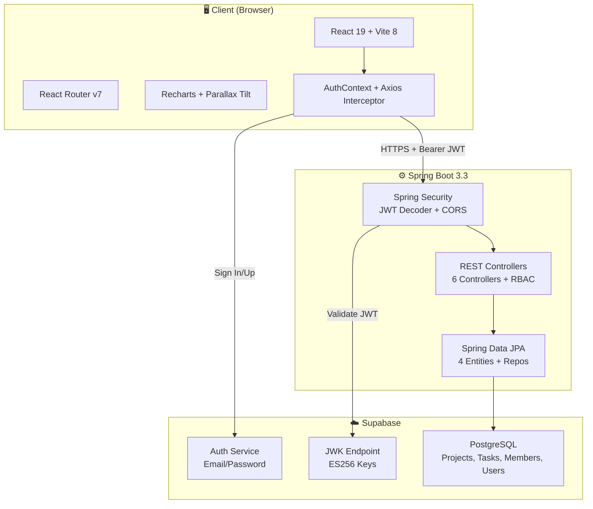
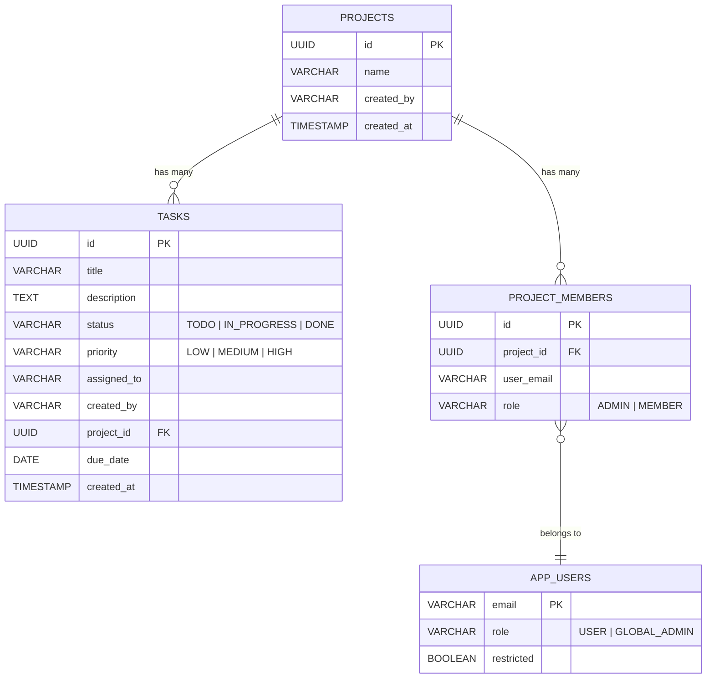

<![CDATA[<div align="center">
  
  
  
  
  
  

  <br /><br />

  <h1>🚀 TeamTask</h1>
  <h3>Full-Stack Team Task Management Platform</h3>

  <p>A production-grade collaborative project & task management system<br />built with <b>React</b>, <b>Spring Boot</b>, <b>Supabase</b>, and <b>PostgreSQL</b>.</p>

  <br />

  
  
  
  

  <br /><br />

  <a href="#-key-features">Features</a> &nbsp;•&nbsp;
  <a href="#-system-architecture">Architecture</a> &nbsp;•&nbsp;
  <a href="#-tech-stack">Tech Stack</a> &nbsp;•&nbsp;
  <a href="#-getting-started">Getting Started</a> &nbsp;•&nbsp;
  <a href="#-api-endpoints">API Reference</a>
</div>

<br />

---

## 📖 About

**TeamTask** is a cloud-deployed team collaboration platform where organizations can manage projects, delegate tasks with priorities and deadlines, track workloads through interactive analytics dashboards, and administer users with role-based access control.

The system follows a **decoupled full-stack architecture** — a React SPA communicates with a Spring Boot REST API, authenticated through Supabase JWT tokens, and persisted to a PostgreSQL database.

> **Why this project?** Teams need a centralized workspace to organize work into projects, assign tasks with priorities, get real-time visibility into workload distribution, and give admins tools to manage the platform — all in one place.

---

## ✨ Key Features

<table>
  <tr>
    <td width="50%">

### 🔐 Authentication & Security
- Supabase Auth with email/password + confirmation flow
- JWT-secured API (ES256 algorithm)
- Role-based access: `USER` and `GLOBAL_ADMIN`
- Account suspension with instant platform lockout
- Frontend protected route guards

</td>
<td width="50%">

### 📁 Project Management
- Create projects with auto admin membership
- Invite members by email (Admin / Member roles)
- Cascade delete (project → tasks → memberships)
- Membership-scoped access (users see only their projects)

</td>
  </tr>
  <tr>
    <td width="50%">

### ✅ Task Management
- Full CRUD with searchable assignee dropdown
- Priority system: `LOW` · `MEDIUM` · `HIGH` (color-coded)
- Status workflow: `TODO` → `IN_PROGRESS` → `DONE`
- Due dates with overdue detection & pulsing alerts
- Inline editing via modals

</td>
<td width="50%">

### 📊 Dashboard & Analytics
- Dual-tab view: _Assigned to Me_ vs _I Assigned_
- Interactive Pie chart (status) & Bar chart (workload)
- Multi-filter: status, priority, due date sorting
- 3D parallax tilt task cards with glare effects

</td>
  </tr>
  <tr>
    <td width="50%">

### 🛡️ Admin Dashboard
- Platform-wide stats (users, projects, tasks)
- Global task status pie chart
- Per-user task distribution bar chart
- User management: promote/demote, suspend/unsuspend

</td>
<td width="50%">

### 📱 Responsive Design
- Mobile-first layout with hamburger navigation
- Adaptive 1/2/3/4-column grids
- Glassmorphism UI with backdrop blur
- Micro-animations and hover transforms

</td>
  </tr>
</table>

---

## 🏗️ System Architecture



---

## 🛠️ Tech Stack

<table>
  <tr>
    <th align="left">Layer</th>
    <th align="left">Technology</th>
    <th align="left">Purpose</th>
  </tr>
  <tr><td rowspan="8"><b>Frontend</b></td><td>React 19</td><td>UI library with hooks & functional components</td></tr>
  <tr><td>Vite 8</td><td>Lightning-fast build tool and dev server</td></tr>
  <tr><td>Tailwind CSS 4</td><td>Utility-first CSS with glassmorphism tokens</td></tr>
  <tr><td>React Router v7</td><td>Client-side routing with protected route guards</td></tr>
  <tr><td>Recharts</td><td>Composable charting (Pie, Bar) for analytics</td></tr>
  <tr><td>react-parallax-tilt</td><td>3D hover effects on task cards</td></tr>
  <tr><td>Axios</td><td>HTTP client with JWT interceptor</td></tr>
  <tr><td>Supabase JS SDK</td><td>Auth client (sign up, sign in, sessions)</td></tr>
  <tr><td rowspan="6"><b>Backend</b></td><td>Spring Boot 3.3</td><td>REST API framework with auto-configuration</td></tr>
  <tr><td>Spring Security</td><td>OAuth2 Resource Server with JWT validation</td></tr>
  <tr><td>Spring Data JPA</td><td>ORM layer with repository pattern</td></tr>
  <tr><td>PostgreSQL</td><td>Relational database for all data</td></tr>
  <tr><td>Lombok</td><td>Boilerplate reduction for models</td></tr>
  <tr><td>Java 17</td><td>LTS Java runtime</td></tr>
  <tr><td rowspan="3"><b>Infra</b></td><td>Vercel</td><td>Frontend deployment with CI/CD</td></tr>
  <tr><td>Railway</td><td>Backend deployment with managed DB</td></tr>
  <tr><td>Supabase</td><td>Auth service with JWK endpoint</td></tr>
</table>

---

## 📂 Project Structure

```
📦 team-task-manager
├── 🎨 frontend/                            React SPA (Vite)
│   └── src/
│       ├── components/
│       │   └── Navbar.jsx                  Responsive nav + hamburger menu
│       ├── context/
│       │   └── AuthContext.jsx             Supabase auth state + JWT mgmt
│       ├── lib/
│       │   ├── api.js                      Axios instance + JWT interceptor
│       │   └── supabase.js                 Supabase client init
│       ├── pages/
│       │   ├── Login.jsx                   Sign in + animated blob bg
│       │   ├── Signup.jsx                  Register + full name capture
│       │   ├── Dashboard.jsx               Analytics + charts + task cards
│       │   ├── Projects.jsx                Project grid + create modal
│       │   ├── ProjectDetail.jsx           Task board + CRUD + invites
│       │   └── AdminDashboard.jsx          Admin panel + user mgmt
│       ├── App.jsx                         Routes + protected wrapper
│       └── main.jsx                        Entry point + AuthProvider
│
├── ⚙️ backend/                             Spring Boot REST API
│   └── src/main/java/com/example/demo/
│       ├── config/
│       │   ├── SecurityConfig.java         JWT decoder + CORS + filter chain
│       │   ├── WebConfig.java              Web MVC config
│       │   └── UserRestrictionInterceptor  Account suspension interceptor
│       ├── controller/
│       │   ├── ProjectController.java      Project CRUD + member mgmt
│       │   ├── TaskController.java         Task CRUD + RBAC
│       │   ├── DashboardController.java    Aggregated analytics
│       │   ├── AdminController.java        Global admin operations
│       │   ├── UserController.java         User profile endpoint
│       │   └── HealthController.java       Health check
│       ├── model/
│       │   ├── Project.java                UUID PK entity
│       │   ├── Task.java                   Priority + status fields
│       │   ├── ProjectMember.java          Project ↔ User join table
│       │   └── AppUser.java                Role + restriction flags
│       ├── dto/
│       │   └── AdminStatsResponse.java     Admin analytics DTO
│       └── repository/                     JPA repositories (4 repos)
│
└── 📄 README.md
```

---

## 🗄️ Database Schema



---

## 🔌 API Endpoints

> All endpoints except `/health` require `Authorization: Bearer <JWT>` header.

<details>
<summary><b>📁 Projects</b> — 6 endpoints</summary>

| Method | Endpoint | Description | Access |
|:------:|----------|-------------|--------|
| `POST` | `/projects` | Create a new project | Authenticated |
| `GET` | `/projects` | List user's projects | Authenticated |
| `GET` | `/projects/:id` | Get project details | Project Member |
| `DELETE` | `/projects/:id` | Delete project (cascade) | Project Admin / Global Admin |
| `POST` | `/projects/:id/members` | Invite a team member | Project Admin |
| `GET` | `/projects/:id/members` | List project members | Project Member |

</details>

<details>
<summary><b>✅ Tasks</b> — 4 endpoints</summary>

| Method | Endpoint | Description | Access |
|:------:|----------|-------------|--------|
| `POST` | `/tasks` | Create a task | Project Admin |
| `GET` | `/tasks?projectId=<UUID>` | List project tasks | Project Member |
| `PATCH` | `/tasks/:id` | Update task (status/details) | Admin / Creator / Assignee |
| `DELETE` | `/tasks/:id` | Delete a task | Admin / Creator |

</details>

<details>
<summary><b>📊 Dashboard</b> — 1 endpoint</summary>

| Method | Endpoint | Description | Access |
|:------:|----------|-------------|--------|
| `GET` | `/dashboard` | Aggregated task analytics | Authenticated |

</details>

<details>
<summary><b>🛡️ Admin</b> — 4 endpoints</summary>

| Method | Endpoint | Description | Access |
|:------:|----------|-------------|--------|
| `GET` | `/admin/users` | List all users | Global Admin |
| `PATCH` | `/admin/users/:email/restrict` | Suspend/unsuspend user | Global Admin |
| `PATCH` | `/admin/users/:email/role` | Promote/demote user | Global Admin |
| `GET` | `/admin/stats` | Platform-wide statistics | Global Admin |

</details>

<details>
<summary><b>🔧 Utility</b> — 2 endpoints</summary>

| Method | Endpoint | Description | Access |
|:------:|----------|-------------|--------|
| `GET` | `/health` | Health check | Public |
| `GET` | `/users/me` | Current user profile | Authenticated |

</details>

---

## 🚀 Getting Started

### Prerequisites

| Tool | Version |
|------|---------|
| Node.js | ≥ 18 |
| Java | 17 |
| Maven | 3.8+ |
| PostgreSQL | 15+ (or Supabase project) |

### 1️⃣ Clone

```bash
git clone https://github.com/RAJNEESHMIST/team-task-manager.git
cd team-task-manager
```

### 2️⃣ Backend

```bash
cd backend
```

Create `src/main/resources/application.properties`:

```properties
spring.datasource.url=jdbc:postgresql://localhost:5432/taskmanager
spring.datasource.username=your_db_username
spring.datasource.password=your_db_password
spring.jpa.hibernate.ddl-auto=update
spring.jpa.show-sql=true
server.port=8080
```

```bash
./mvnw spring-boot:run
# API available at http://localhost:8080
```

### 3️⃣ Frontend

```bash
cd frontend
npm install
```

Create `.env`:

```env
VITE_API_URL=http://localhost:8080
VITE_SUPABASE_URL=your_supabase_project_url
VITE_SUPABASE_ANON_KEY=your_supabase_anon_key
```

```bash
npm run dev
# App available at http://localhost:5173
```

---

## 🌐 Deployment

| Layer | Platform | Details |
|-------|----------|---------|
| Frontend | **Vercel** | Git integration with auto CI/CD |
| Backend | **Railway** | Deployed via Nixpacks |
| Database | **Supabase** | Managed PostgreSQL |
| Auth | **Supabase** | Email/password with JWT |

<details>
<summary><b>Environment Variables</b></summary>

**Frontend (Vercel)**
```
VITE_API_URL=https://your-backend.railway.app
VITE_SUPABASE_URL=https://your-project.supabase.co
VITE_SUPABASE_ANON_KEY=your_anon_key
```

**Backend (Railway)**
```
SPRING_DATASOURCE_URL=jdbc:postgresql://your-db-host:5432/railway
SPRING_DATASOURCE_USERNAME=postgres
SPRING_DATASOURCE_PASSWORD=your_password
```

</details>

---

## 📚 What I Learned

<table>
<tr>
<td width="33%">

### ⚙️ Backend
- OAuth2 Resource Server with Supabase JWT (ES256)
- Multi-level RBAC: Global Admin → Project Admin → Member → Assignee
- User restriction interceptor for mid-request account blocking
- Transactional cascade deletion
- CORS wildcard patterns for Vercel previews

</td>
<td width="33%">

### 🎨 Frontend
- React Context for global auth state with Supabase listeners
- Axios interceptors for JWT injection & 403 handling
- Interactive Recharts visualizations
- Custom searchable select components
- Mobile-responsive layout with adaptive grids

</td>
<td width="34%">

### 🚢 DevOps
- Spring Boot deployment on Railway with env var injection
- Vercel SPA routing with rewrite rules
- Cross-environment connectivity (Vercel ↔ Railway)
- PostgreSQL managed via Supabase

</td>
</tr>
</table>

---

## 🔮 Future Enhancements

- [ ] **Real-time updates** — WebSocket for live task status changes
- [ ] **Kanban board** — Drag-and-drop task columns
- [ ] **Notifications** — Email/in-app alerts for assignments & deadlines
- [ ] **File attachments** — Upload documents per task
- [ ] **Activity log** — Audit trail for all changes
- [ ] **Team chat** — In-project messaging
- [ ] **Time tracking** — Log hours on tasks
- [ ] **CSV/PDF export** — Downloadable reports

---

## 🤝 Contributing

Contributions, issues, and feature requests are welcome!
Feel free to check the [issues page](https://github.com/RAJNEESHMIST/team-task-manager/issues).

---

<div align="center">
  <br />

  **Built with ❤️ by [Rajneesh](https://github.com/RAJNEESHMIST)**

  <sub>If you found this project helpful, please consider giving it a ⭐</sub>

  <br />
</div>
]]>
